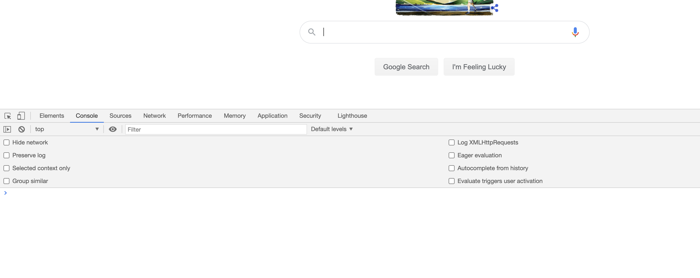

# Day 1. Getting Started with JavaScript

If you system has a web browser, then you system can already run JavaScript. This is pretty cool. So let's check it out.


## 1. Using Chrome
I'll be using chrome for this but many of you can absolutely use Firefox, Safari, Opera, and Edge to accomplish the same thing.

We'll be using the web browser as a basic introduction to JavaScript but later we'll be installing `Node.js` to allow for more powerful local JavaScript development.

#### Open the JavaScript Console:
- Mac (Command + Option + J)
- Windows (Control + Shift + J)

What you should see is something like this:



The term `console` refers to the `JavaScript` console. As you can likely tell, you can actually type commands in here.

Copy and paste the following code into the console:

```
console.log("Hello world")
```

Press `enter`/`return`

What happens?

You will likely see:

```
hello world
undefined
```
Simple enough. Let's keep going.

Now, let's do something a bit more drastic. Copy and paste this command:

```
document.getElementsByTagName("body")[0].style.backgroundColor = "red"
```
> Be sure to press `enter`/`return`.

Uh oh??! Did you just hack this website??

Well no. It might be a ~~fun~~ nerdy party trick but as you may know, you can change how any website renders on your own browser but that doesn't affect anyone else in the least. Refresh any page and you'll see what I mean.


I'm telling you about a Browser console is for a few reasons:

- You can often test your JavaScript in there; especially JavaScript that doesn't depend on SEC (someone else's code).
- You can test loaded scripts on pages
- You can rapid prototype new features for a website


This is cool but it doesn't give us the full feature set that JavaScript provides. For that, we need to install `node.js`.

`Node.js` is a package you can install on nearly any system and it's incredibly easy to setup. 

## 2. Install Node.js 

Go to [nodejs.org](https://nodejs.org/en/download/), find the system you want to use, and download the latest LTS version of node.js

> **LTS** is a common term in software; it means Long Term Support. LTS versions receive updates (or patches) to the code much longer than non-LTS versions. I think every beginner should go LTS all the time. 

As of September 2020, the current LTS version of Node.js is `12.18.3` The main number, as it relates to `node.js` you need to consider is `12` and pay less attention to `18.3` since `version 12` is the LTS regardless of the proceeding numbers.

Okay. Have you downloaded `Node.js` yet?


So what is `Node.js` exactly? 

Put simply, it allows us to run JavaScript on our local machine and with it we can:

- Build web application backends
- Build web application front ends
- Build native mobile apps
- Build & run machine learning
- Build native desktop apps
- Build apps that control robots
- Build apps that control rockets
- Build apps that create animations
- Build apps that build apps that create animtaions

In other words, `Node.js` allows us to unlock the potential of writing code with `JavaScript`. 


## 3. Our first project

In `JavaScript`, we call projects `packages` and you'll soon come to learn to love looking at `package.json` for all the nitty gritty details of a project.

It's true, you don't have to create a package to use JavaScript (like I showed you above in a browser's console) but it is simply the downright best way to build projects in `JavaScript`.

With packages comes the dreaded `node_modules` directory. You'll see why once we get there but remember this: using SEC (someone else's code) comes with baggage sometimes a lot and sometimes a little. This baggage is stored into a directory (aka folder) called `node_modules` inside your project's primary folder.

So let's build a incredibly simple project.

### 1. Open up your Command Line App
- Mac/ Linux users open the app `Terminal`
- Windows users open the app `PowerShell`

`Terminal` (or `PowerShell`) is one of the many ways to write commands for your computer to do things. In our case, we need it to do things related to `Node.js`. If you haven't ever used a command line, this will be pretty uncomfortable at first but over time you'll get the hang of it.

First command, let's verify that node.js was installed correctly. What you see below is what you should type and press enter in your command line (ie `Terminal` for mac/linux users and `PowerShell` for windows users).

```shell
% node -v
v12.18.3
```
> Notice the `%` before our command? That's because I'm using `Terminal` on Mac. If you're on linux you'll see `$` and if you're on windows you'll see `>`. There might be a lot of text prior to these characters and that's 100% ok. 

> If you get an error with the above command, that means you didn't install node.js correctly or you need to restart `Terminal`/`PowerShell`

Also note that, in the above case, `node -v` is the command and after you hit `enter`/`return` - `v12.18.3` is the response from that command.


### 2. Navigation & Making Directories

Every time you open up `Terminal` or `PowerShell` you are in the root of your users' primary system folder. You can the exact location of where you are by the following commands:

**Mac/Linux**
```
% pwd
```

**PowerShell**
```
> dir
```

> There are many commands like this you'll learn over time and usage. I'll be sure to write the system differences as they come up. When in doubt, you can try the command. If you see a `command not found` error or a `Unknown command` then you know that particular command either doesn't work on that system  


### 3. `npm init`
> Section coming soon.